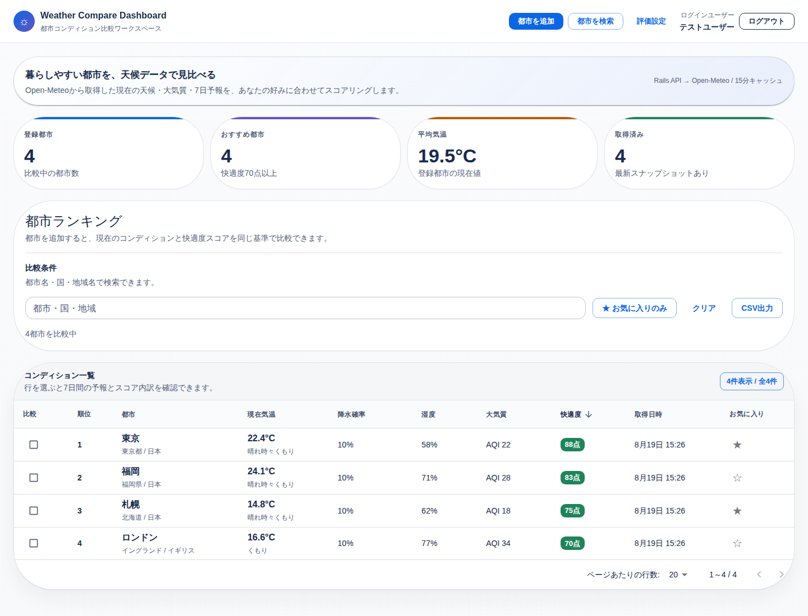
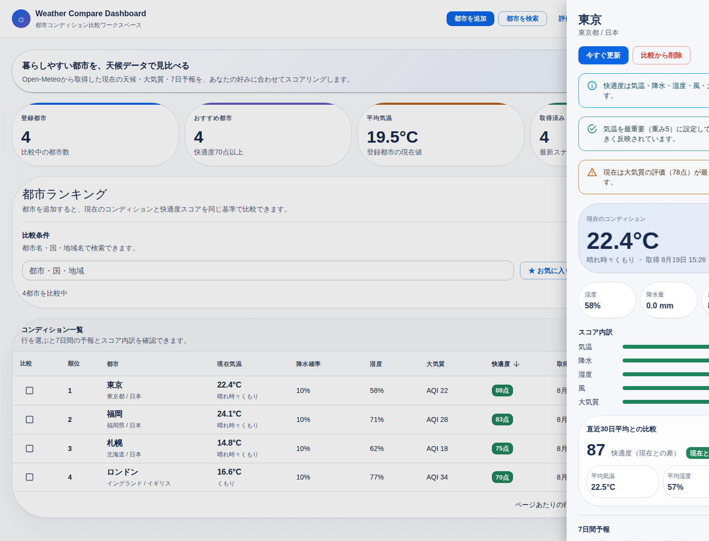

# Weather Compare Dashboard

Open-Meteoから取得した都市の天候・大気質・7日間予報を、ユーザーごとの評価基準で比較するダッシュボードです。

NestJS / TypeScriptとReact / TypeScriptを使い、外部API取得、レスポンス正規化、DB保存、キャッシュ、スコアリング、CSV出力、定期同期までを一つのアプリにまとめています。

[GitHub Repository](https://github.com/naoki-webdev/weather)





## 主な機能

- 複数都市の現在の天候・大気質を横並びで比較し、快適度ランキングを表示
- ユーザーごとの目標気温・評価ウェイトに基づいてスコアを計算し、評価理由と内訳を表示
- 直近30日間の保存データと現在のコンディションを比較
- 2都市間の車移動時間から到着予定時刻を算出し、到着時の天気と傘の判断材料を表示
- 出発可能時間帯を15分刻みで比較し、雨を避けやすいおすすめ出発時刻を提案

## アーキテクチャ

```text
React / TypeScript
        ↓
NestJS / TypeScript API
        ├─ Open-Meteo Geocoding / Forecast / Air Quality API
        ├─ OSRM Routing API（道路ルート）
        ├─ Prisma ORM
        │      ↓
        └─ PostgreSQL
               ↓
       到着予定時刻の天候判定
```

ブラウザから外部APIを直接呼び出さず、NestJS側で取得・正規化・キャッシュ・保存を行います。API障害時は保存済みの最新スナップショットを利用できる構成です。

認証、都市比較、天候取得、スコア計算、CSV出力、定期同期はNestJSのModule / Guard / Service / Schedulerに分離しています。フロントエンドはReactの画面構成とAPI通信・状態遷移を分けています。

## 外部API連携

### 天候・大気質

- [Geocoding API](https://open-meteo.com/en/docs/geocoding-api) で都市候補を検索
- [Forecast API](https://open-meteo.com/en/docs) で現在値と7日間予報を取得
- Forecast APIの時間別データで、移動先の到着時刻の天気を評価
- [Air Quality API](https://open-meteo.com/en/docs/air-quality-api) でUS AQI、PM2.5、PM10を取得
- APIキーは不要で、NestJS側の`WeatherClient`から呼び出します

### 移動と到着時の天気

- [OSRM](https://project-osrm.org/) のRouting APIで2都市間の道路ルートを取得
- 移動時間を出発時刻に加算し、目的地の時間別予報と照合
- 到着時の降水確率に応じて「傘推奨」「天候に注意」「傘は不要そう」を表示
- 出発可能時間帯を15分刻みで評価し、降水確率が低い候補を推薦
- 到着予定時刻が7日間予報の範囲外の場合は、最近傍時刻へ補間せず対象外として扱う

この機能は公共交通機関の乗換案内ではなく、車移動の目安です。

## デモ

seedではデモ確認用に、東京・札幌・福岡・ロンドンの現在スナップショットと、直近30日分のサンプル履歴を作成します。

```text
email:    demo@example.com
password: password
```

デモユーザーは閲覧専用です。検索・絞り込み・詳細表示・CSV出力は利用できますが、都市の追加・更新・削除と評価設定の保存はできません。

## 開発環境

```bash
docker compose up -d db web
npm install
```

Webコンテナ起動時に、既存データを削除せず、PrismaのMigration適用と空のユーザーへのseedを行います。旧Rails/bootstrap環境の既存スキーマは、列・型・index・制約を確認したうえでbaseline migrationへ引き継ぎます。

開発サーバー:

```bash
npm run dev -- --host 127.0.0.1 --port 5173
```

または、用意されているMakeタスクを使えます。

```bash
make setup
make up
```

NestJS APIだけを確認する場合:

```bash
make api
make server-lint
make server-test
make server-build
```

## 環境変数

`.env.example`にある主な設定:

- `VITE_API_BASE_URL`
- `DEMO_USER_EMAIL`
- `DEMO_USER_PASSWORD`
- `DATABASE_URL`
- `FRONTEND_ORIGIN`（必須。複数指定時はカンマ区切り）
- `JWT_SECRET`（必須。未設定時はAPIの起動に失敗）
- `OSRM_BASE_URL`（任意。デフォルトはOSRM公開Routing API）
- `OPEN_METEO_GEOCODING_ENDPOINT`（任意。デフォルトはOpen-Meteo Geocoding API）
- `OPEN_METEO_FORECAST_ENDPOINT`（任意。デフォルトはOpen-Meteo Forecast API）
- `OPEN_METEO_AIR_QUALITY_ENDPOINT`（任意。デフォルトはOpen-Meteo Air Quality API）

Open-MeteoはAPIキーなしで利用するため、天候専用の秘密鍵はありません。

## 技術的な特徴

- `WeatherClient`に15分間のサーバーキャッシュを実装し、`WeatherService`で最新スナップショットの再利用とDB保存を管理
- 30分ごとのSchedulerで登録都市の天候スナップショットを同期
- 一覧・比較・CSV出力で検索条件の組み立てを共有
- HttpOnlyセッションCookieとDBセッション失効による認証、ユーザー単位のデータ分離
- ログイン・外部API連携エンドポイントへのレート制限
- read-onlyデモユーザーによる公開デモ
- Prisma Migrationによる既存Rails/PostgreSQLスキーマの引き継ぎ

## API

主要なAPIエンドポイント:

```text
GET    /api/cities
GET    /api/cities/search?query=Tokyo
GET    /api/cities/compare?ids[]=1&ids[]=2
POST   /api/cities
GET    /api/cities/:id
POST   /api/cities/:id/sync
PATCH  /api/cities/:id/favorite
DELETE /api/cities/:id
GET    /api/cities/export
GET    /api/weather_preference
PATCH  /api/weather_preference
GET    /api/travel/plan?from_id=1&to_id=2&departure_at=2026-08-20T09:00:00.000Z
GET    /api/travel/best-departure?from_id=1&to_id=2&window_start=2026-08-20T09:00:00.000Z&window_end=2026-08-20T10:00:00.000Z&interval_minutes=15
```

## データモデル

- `User` - 認証ユーザーとread-only権限
- `AuthSession` - JWTの発行単位とログアウト時の失効状態
- `City` - ユーザーが比較する都市
- `WeatherSnapshot` - 都市の現在値・大気質・7日間予報を時系列で保存するデータ
- `WeatherPreference` - ユーザーごとの目標気温と評価ウェイト
- `ActivityLog` - 都市や評価設定の変更履歴

`server/prisma/schema.prisma`と`server/prisma/migrations/`をDB定義のSingle Source of Truthとして扱います。最初の`20260820000000_baseline`は旧Rails/PostgreSQLスキーマを引き継ぐためのMigrationです。以後の変更はMigrationを追加し、`npm --prefix server run prisma:migrate:deploy`で適用します。

## テスト・検証

```bash
npm run lint
npm run test:frontend
npm run build
npm --prefix server run lint
npm --prefix server test -- --runInBand
npm --prefix server run build
npm run test:e2e
```

E2E実行時はDockerの`e2e_web`と外部API stubを自動起動し、OSRMとOpen-Meteoへの通信を固定レスポンスへ差し替えます。これにより、Travel E2Eが公開APIの障害・レート制限・混雑に左右されません。

NestJS側ではスコア計算、認証、read-only制御、都市検索・比較、移動時間からの到着時刻計算、おすすめ出発時刻の候補評価を確認します。フロント側では都市検索、詳細予報、設定、削除、CSV出力、比較UI、移動予定、出発時刻候補を確認します。

## 設計上の工夫

- 外部APIのレスポンスをNestJSで正規化してからキャッシュ・永続化し、表示側のデータ形式を安定させています。
- 出発時刻候補の比較では道路ルートを一度だけ取得し、候補ごとの到着時刻に対する時間別予報を評価しています。
- 7日間予報の範囲外を最近傍時刻へ丸めずエラーにすることで、古い予報を到着時の天気として誤表示しないようにしています。
- Reactでは一覧・比較・詳細・移動予定・評価設定をcustom hookへ分離し、古い検索レスポンスが新しい結果を上書きしないよう制御しています。
- 快適度スコアの係数を定数化し、用途別プリセット（お出かけ、ランニング、洗濯、暑さ回避、空気質重視）から評価基準を切り替えられるようにしています。
