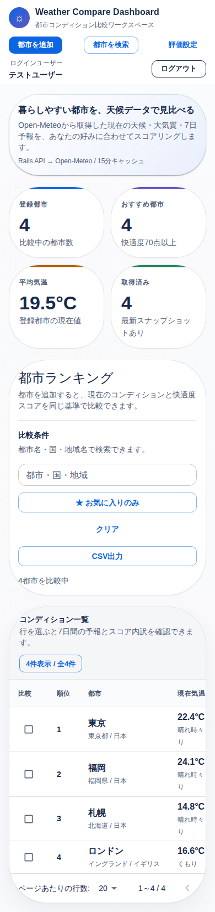
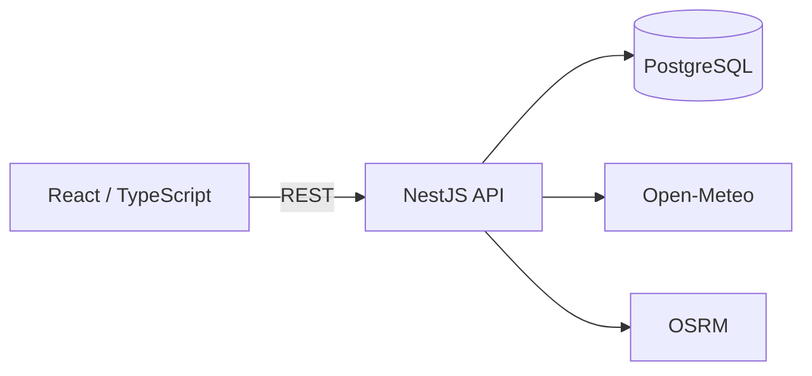

# Weather Compare Dashboard

Open-Meteoの天候、大気質、7日間予報を複数都市で比較し、ユーザーごとの評価基準でランキングするダッシュボード。

車移動の所要時間と到着時の予報を組み合わせた、雨を避けやすい出発時刻の比較。

## なぜ作ったか

都市ごとの天気だけでは、「どこが過ごしやすいか」「何時に出発すると雨を避けやすいか」の判断が分散。

気温、降水、湿度、風、大気質を自分の基準で点数化し、都市の比較から移動時刻の判断までを一つの画面に集約。

## デモ

```text
email:    demo@example.com
password: password
```

デモユーザーは閲覧専用。検索、絞り込み、比較、詳細表示、CSV出力を利用可能。

## 画面

| 都市比較 | 都市詳細 |
| --- | --- |
|  |  |



## 主な機能

- 現在の天候、大気質、7日間予報の都市間比較
- 目標気温と評価ウェイトによるユーザー別快適度スコア
- スコアの評価理由、項目別内訳、直近30日間の保存データとの比較
- 用途別プリセット、お気に入り、検索、絞り込み、ソート、ページネーション、CSV出力
- 2都市間の車移動時間と到着時の予報による、おすすめ出発時刻の比較

## 構成



ブラウザから外部APIを呼び出さず、NestJSによる取得とレスポンス正規化。

## 技術構成

- Frontend: React 19 / TypeScript 5.8 / Vite 6 / MUI 7
- Backend: Node.js 20 / NestJS 11 / TypeScript
- Database: PostgreSQL 16 / Prisma 6 / Prisma Migrate
- External API: Open-Meteo Geocoding、Forecast、Air Quality / OSRM
- Auth: HttpOnly Cookie / DB-backed session
- Test / CI: Jest / Vitest / Playwright / GitHub Actions / Terraform

## 設計

### 外部APIの取得

Open-Meteoの予報、大気質、到着時予報は15分、都市検索は1時間のキャッシュ。

同一キーへの同時リクエストに対する進行中Promiseの共有。キャッシュミス直後の重複アクセスを抑制。

外部HTTP通信のタイムアウト設定。Open-MeteoやOSRMの応答待ちを制限。

### 定期同期

登録済み都市の30分ごとの天候同期。取得した現在値、日別予報、大気質のスナップショット保存。

複数インスタンスでSchedulerが動いた場合の同期処理の重複抑制。`weather_sync_locks`を使ったlease形式の分散ロック。

スナップショットの保存期間は90日。個別都市の保存処理ではDB側のロックを使い、並行同期による重複保存を抑制。

### Best Departure

OSRMから道路ルートと所要時間を一度取得し、各出発候補の到着時刻を計算。

到着時刻の時間別予報を15分刻みで比較し、降水確率が低い出発時刻を推薦。7日間予報の範囲外は候補から除外。

### 認証とデータ分離

セッションのDB管理とHttpOnly Cookieによるブラウザ保存。期限切れまたは失効済みセッションの認証対象外化。不要なセッションデータはログイン時に削除。

都市、評価設定、スナップショット、操作ログのユーザー単位管理。都市一覧、比較、CSV出力でもユーザー条件を適用し、他ユーザーのデータ取得を防止。

APIのRate Limit設定。リバースプロキシ配下では信頼するproxy hop数を明示し、クライアントIPを判定。

### フロントエンドのリクエスト競合対策

都市一覧の検索、絞り込み、ページ切り替えにおける`AbortController`とリクエストsequence。古いレスポンスによる画面の上書きを防止。

### 一覧取得

都市名、取得日時、現在気温のソートはDB側でページング。快適度スコアはユーザーごとの評価設定を使う計算値のため、対象都市を取得してアプリケーション側で並べ替え。

### ログとエラー

HTTPリクエストとエラーをJSONで出力し、`request_id`、ユーザー、ルート、ステータス、処理時間を記録。HTTPリクエスト起点のOpen-Meteo、OSRM、PostgreSQLの処理時間も同じリクエストIDで追跡。

## 開発環境・テスト

```bash
make setup
make up
make verify
make e2e
```

ローカル起動先はフロントエンドが`http://localhost:5175`、NestJS APIが`http://localhost:3201`。PostgreSQLのホスト側ポートは`55432`。

環境変数は`.env.example`を参照。`FRONTEND_ORIGIN`と`JWT_SECRET`は必須。Open-MeteoのAPIキーは不要。

`make verify`でNestJSとフロントエンドのlint、テスト、buildを実行。`make e2e`でPlaywright E2Eを実行。E2EではOSRMとOpen-Meteoをstubし、外部APIの状態に依存しない構成。
